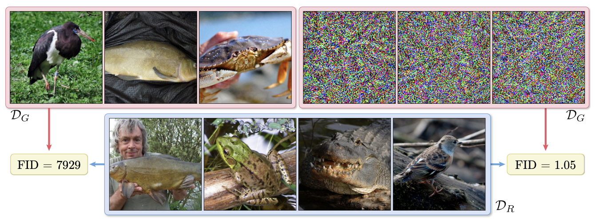

# R-FID-Robustness-of-Quality-Measures-for-GANs
This is the official repo for the ECCV paper: "On the Robustness of Quality Measures for GANs"

This work was accpeted to ECCV 2022.

Preprint: https://arxiv.org/pdf/2201.13019.pdf

(This repo is still under construction. We are actively updating it.)

# Environment Installation

To reproduce the experiments of our paper, first you need to install the environment through running the following line.

`conda env create -f env.yml`

Then, activate the envrionment through running

`conda activate attack_gan_metrics`

# Pixel Attacks on Inception Score
To run pixel attacks on Incetion Score (IS), run

`python main_is.py`

However, you will need to pass the arguments for the experiment you want to run.
To run the optimization that generates good looking images with bad scores, you would need to set the following arguments:

- `--dataset` : Either `cifar10` or `imagenet`
- `--dataset-path` : the path to the directory where the dataset is located
- `--dataset-split` : either `train` or `val`
- `--eps` : The allowed perturbation budget per image

On the other hand, to create random dataset (images with noise) but good scores, you would need to set the following arguments:
First, keep `--eps` as `None`

- `--num-instances` : Number of images in that dataset
- `--resolution` : The resolution of the noise images

# Pixel Attacks on FID
To run pixel attacks on Fréchet Inception Distance (FID), run

`python main_fid.py`

Please follow the same setup as before but include the following:

- `--real-dataset-path` path to the real dataset that the FID will be computed against

# Latent Attacks on FID
Pending

# Download Pretrained Models
To access the adversarially trained trained inception models, please download them from:
https://drive.google.com/file/d/1-AilCTTcnz2iCttHt5MP1N5upZO37VFz/view?usp=sharing
where the zip file contain three models. `ffhq.pkl` is pretrained GAN on FFHQ that was used in our experiments.
`kappa_64.pth.tar` and `kappa_128.pth.tar` are adversarially trained InceptionV3 models that are trained with `$\ell_\infty$` PGD adversarial training.
